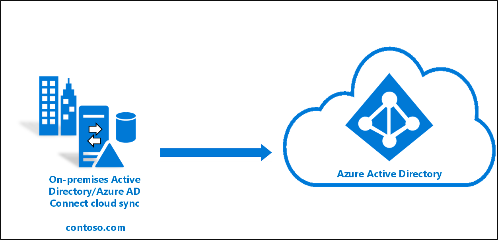
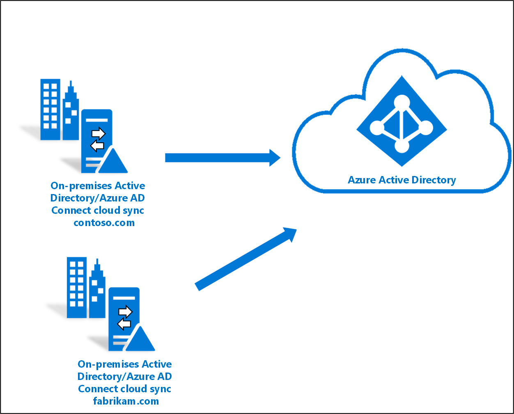
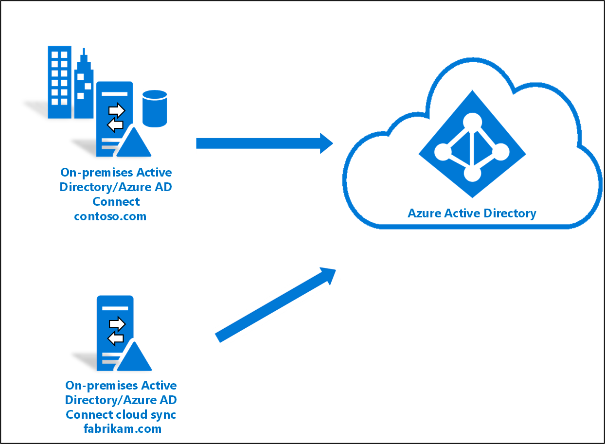
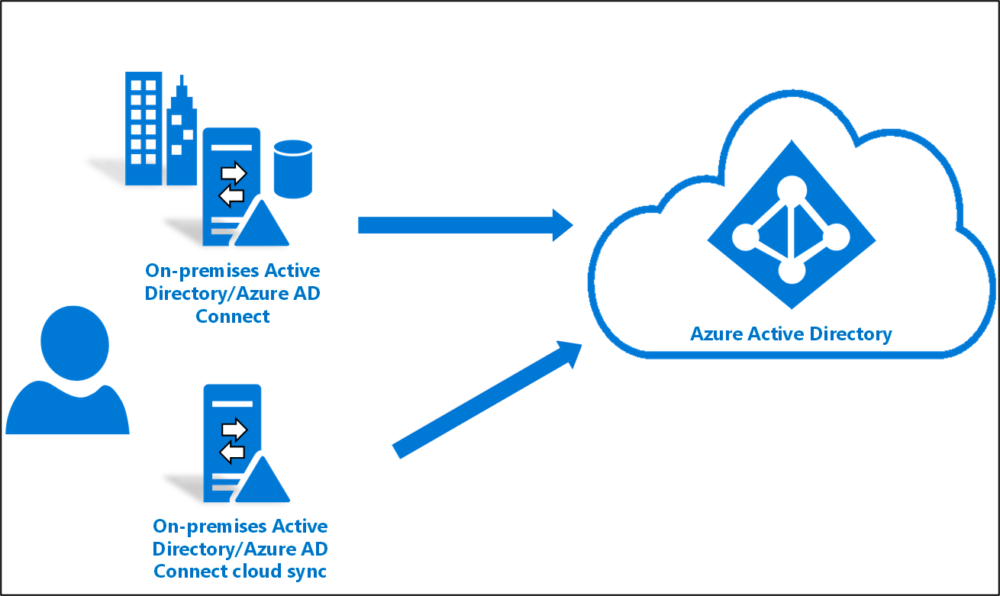

# Azure AD Connect cloud sync supported topologies and scenarios
This article describes various on-premises and Azure Active Directory (Azure AD) topologies that use Azure AD Connect cloud sync. This article includes only supported configurations and scenarios.

> [!IMPORTANT]
> Microsoft doesn't support modifying or operating Azure AD Connect cloud sync outside of the configurations or actions that are formally documented. Any of these configurations or actions might result in an inconsistent or unsupported state of Azure AD Connect cloud sync. As a result, Microsoft can't provide technical support for such deployments.

For more information, see the following video.

> [!VIDEO https://www.microsoft.com/en-us/videoplayer/embed/RWJ8l5]

## Things to remember about all scenarios and topologies
The information below should be kept in mind, when selecting a solution.

- Users and groups must be uniquely identified across all forests
- Matching across forests doesn't occur with cloud sync
- A user or group must be represented only once across all forests
- The source anchor for objects is chosen automatically.  It uses ms-DS-ConsistencyGuid if present, otherwise ObjectGUID is used.
- You can't change the attribute that is used for source anchor.

## Single forest, single Azure AD tenant

The simplest topology is a single on-premises forest, with one or multiple domains, and a single Azure AD tenant.  For an example of this scenario see [Tutorial: A single forest with a single Azure AD tenant](tutorial-single-forest.md)

## Multi-forest, single Azure AD tenant

Multiple AD forests is a common topology, with one or multiple domains, and a single Azure AD tenant.  

## Existing forest with Azure AD Connect, new forest with cloud Provisioning

This scenario is topology is similar to the multi-forest scenario, however this one involves an existing Azure AD Connect environment and then bringing on a new forest using Azure AD Connect cloud sync.  For an example of this scenario see [Tutorial: An existing forest with a single Azure AD tenant](tutorial-existing-forest.md)

## Piloting Azure AD Connect cloud sync in an existing hybrid AD forest

The piloting scenario involves the existence of both Azure AD Connect and Azure AD Connect cloud sync in the same forest and scoping the users and groups accordingly. NOTE: An object should be in scope in only one of the tools. 

For an example of this scenario see [Tutorial: Pilot Azure AD Connect cloud sync in an existing synced AD forest](tutorial-pilot-aadc-aadccp.md)

## Merging objects from disconnected sources 
### (Public Preview)

In this scenario, the attributes of a user are contributed to by two disconnected Active Directory forests. 

An example would be:

 - one forest (1) contains most of the attributes
 - a second forest (2) contains a few attributes

 Since the second forest doesn't have network connectivity to the Azure AD Connect server, the object can't be merged through Azure AD Connect. Cloud Sync in the second forest allows the attribute value to be retrieved from the second forest. The value can then be merged with the object in Azure AD that is synced by Azure AD Connect. 

This configuration is advanced and there are a few caveats to this topology: 

 1. You must use `msdsConsistencyGuid` as the source anchor in the Cloud Sync configuration.
 2. The `msdsConsistencyGuid` of the user object in the second forest must match that of the corresponding object in Azure AD.
 3. You must populate the `UserPrincipalName` attribute and the `Alias` attribute in the second forest and it must match the ones that are synced from the first forest. 
 4. You must remove all attributes from the attribute mapping in the Cloud Sync configuration that don't have a value or may have a different value in the second forest – you can't have overlapping attribute mappings between the first forest and the second one. 
 5. If there's no matching object in the first forest, for an object that is synced from the second forest, then Cloud Sync will still create the object in Azure AD. The object will only have the attributes that are defined in the mapping configuration of Cloud Sync for the second forest. 
 6. If you delete the object from the second forest, it will be temporarily soft deleted in Azure AD. It will be restored automatically after the next Azure AD Connect sync cycle.  
 7. If you delete the object from the first forest, it will be soft deleted from Azure AD.  The object won't be restored unless a change is made to the object in the second forest. After 30 days the object will be hard deleted from Azure AD and if a change is made to the object in the second forest it will be created as a new object in Azure AD. 

 

## Next steps 

- [What is provisioning?](what-is-provisioning.md)
- [What is Azure AD Connect cloud sync?](what-is-cloud-sync.md)

