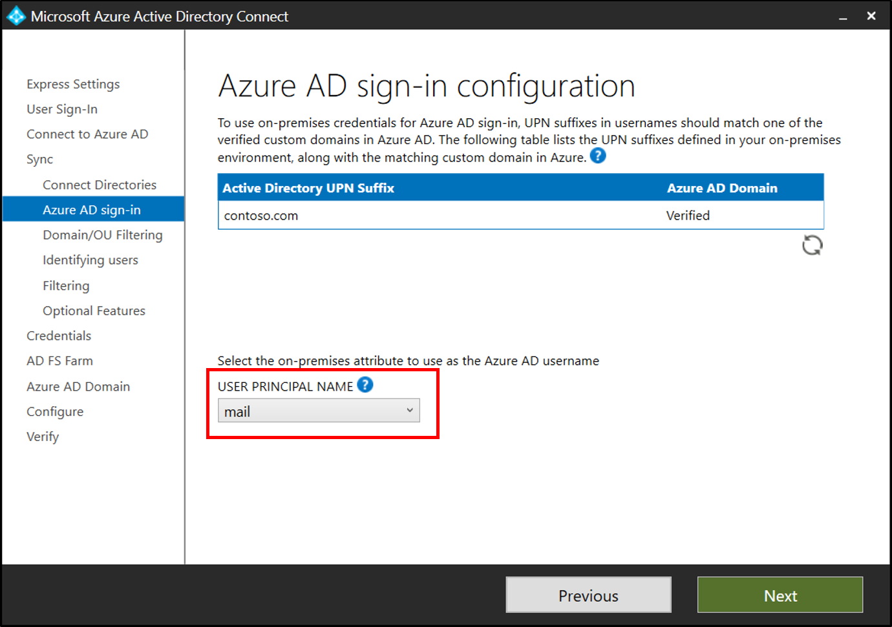
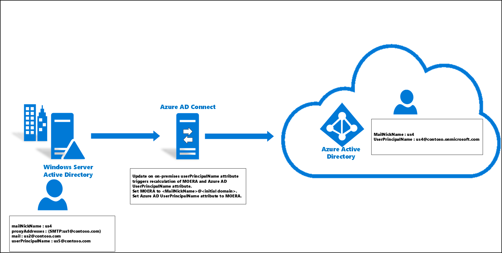

# Azure AD UserPrincipalName population

This article describes how the UserPrincipalName attribute is populated in Azure Active Directory (Azure AD).
The UserPrincipalName attribute value is the Azure AD username for the user accounts.

## UPN terminology
The following terminology is used in this article:

|Term|Description|
|-----|-----|
|Initial domain|The default domain (onmicrosoft.com) in the Azure AD Tenant. For example, contoso.onmicrosoft.com.|
|Microsoft Online Email Routing Address (MOERA)|Azure AD calculates the MOERA from Azure AD MailNickName attribute and Azure AD initial domain as &lt;MailNickName&gt;&#64;&lt;initial domain&gt;.|
|On-premises mailNickName attribute|An attribute in Active Directory, the value of which represents the alias of a user in an Exchange organization.|
|On-premises mail attribute|An attribute in Active Directory, the value of which represents the email address of a user|
|Primary SMTP Address|The primary email address of an Exchange recipient object. For example, SMTP:user\@contoso.com.|
|Alternate login ID|An on-premises attribute other than UserPrincipalName, such as mail attribute, used for sign-in.|

## What is UserPrincipalName?
UserPrincipalName is an attribute that is an Internet-style login name for a user based on the Internet standard [RFC 822](https://www.ietf.org/rfc/rfc0822.txt). 

### UPN format
A UPN consists of a UPN prefix (the user account name) and a UPN suffix (a DNS domain name). The prefix is joined with the suffix using the "\@" symbol. For example, "someone\@example.com". A UPN must be unique among all security principal objects within a directory forest. 

## UPN in Azure AD 
The UPN is used by Azure AD to allow users to sign-in.  The UPN that a user can use, depends on whether or not the domain has been verified.  If the domain has been verified, then a user with that suffix will be allowed to sign-in to Azure AD.  

The attribute is synchronized by Azure AD Connect.  During installation, you can view the domains that have been verified and the ones that have not.

    

## Alternate login ID
In some environments, end users may only be aware of their email address and not their UPN.  The use of email address may be due to a corporate policy or an on-premises line-of-business application dependency.

Alternate login ID allows you to configure a sign-in experience where users can sign-in with an attribute other than their UPN, such as mail.

To enable Alternate login ID with Azure AD, no additional configurations steps are needed when using Azure AD Connect. Alternate ID can be configured directly from the wizard. See Azure AD sign-in configuration for your users under the section Sync. Under the **User Principal Name** drop-down, select the attribute for Alternate login ID.

  

For more information, see [Configure Alternate login ID](/windows-server/identity/ad-fs/operations/configuring-alternate-login-id) and [Azure AD sign-in configuration](how-to-connect-install-custom.md#azure-ad-sign-in-configuration)

## Non-verified UPN Suffix
If the on-premises UserPrincipalName attribute/Alternate login ID suffix is not verified with Azure AD Tenant, then the Azure AD UserPrincipalName attribute value is set to MOERA. Azure AD calculates the MOERA from the Azure AD MailNickName attribute and Azure AD initial domain as &lt;MailNickName&gt;&#64;&lt;initial domain&gt;.

## Verified UPN suffix
If the on-premises UserPrincipalName attribute/Alternate login ID suffix is verified with the Azure AD Tenant, then the Azure AD UserPrincipalName attribute value is going to be the same as the on-premises UserPrincipalName attribute/Alternate login ID value.

## Azure AD MailNickName attribute value calculation
Because the Azure AD UserPrincipalName attribute value could be set to MOERA, it is important to understand how the Azure AD MailNickName attribute value, which is the MOERA prefix, is calculated.

When a user object is synchronized to an Azure AD Tenant for the first time, Azure AD checks the following items in the given order and sets the MailNickName attribute value to the first existing one:

- On-premises mailNickName attribute
- Prefix of primary SMTP address
- Prefix of on-premises mail attribute
- Prefix of on-premises userPrincipalName attribute/Alternate login ID
- Prefix of secondary smtp address

When the updates to a user object are synchronized to the Azure AD Tenant, Azure AD updates the MailNickName attribute value only in case there is an update to the on-premises mailNickName attribute value.

>[!IMPORTANT]
>Azure AD recalculates the UserPrincipalName attribute value only in case an update to the on-premises UserPrincipalName attribute/Alternate login ID value is synchronized to the Azure AD Tenant. 
>
>Whenever Azure AD recalculates the UserPrincipalName attribute, it also recalculates the MOERA. 

## UPN scenarios
The following are example scenarios of how the UPN is calculated based on the given scenario.

### Scenario 1: Non-verified UPN suffix – initial synchronization

On-Premises user object:
- mailNickName		: &lt;not set&gt;
- proxyAddresses		: {SMTP:us1@contoso.com}
- mail			: us2@contoso.com
- userPrincipalName	: us3@contoso.com

Synchronized the user object to Azure AD Tenant for the first time
- Set Azure AD MailNickName attribute to primary SMTP address prefix.
- Set MOERA to  &lt;MailNickName&gt;&#64;&lt;initial domain&gt;.
- Set Azure AD UserPrincipalName attribute to MOERA.

Azure AD Tenant user object:
- MailNickName		: us1			
- UserPrincipalName	: us1@contoso.onmicrosoft.com

### Scenario 2: Non-verified UPN suffix – set on-premises mailNickName attribute

On-Premises user object:
- mailNickName		: us4
- proxyAddresses		: {SMTP:us1@contoso.com}
- mail			: us2@contoso.com
- userPrincipalName	: us3@contoso.com

Synchronize update on on-premises mailNickName attribute to Azure AD Tenant
- Update Azure AD MailNickName attribute with on-premises mailNickName attribute.
- Because there is no update to the on-premises userPrincipalName attribute, there is no change to the Azure AD UserPrincipalName attribute.

Azure AD Tenant user object:
- MailNickName		: us4
- UserPrincipalName	: us1@contoso.onmicrosoft.com

### Scenario 3: Non-verified UPN suffix – update on-premises userPrincipalName attribute

On-Premises user object:
- mailNickName		: us4
- proxyAddresses		: {SMTP:us1@contoso.com}
- mail			: us2@contoso.com
- userPrincipalName	: us5@contoso.com

Synchronize update on on-premises userPrincipalName attribute to Azure AD Tenant
- Update on on-premises userPrincipalName attribute triggers recalculation of MOERA and Azure AD UserPrincipalName attribute.
- Set MOERA to &lt;MailNickName&gt;&#64;&lt;initial domain&gt;.
- Set Azure AD UserPrincipalName attribute to MOERA.

Azure AD Tenant user object:
- MailNickName		: us4
- UserPrincipalName	: us4@contoso.onmicrosoft.com

### Scenario 4: Non-verified UPN suffix – update primary SMTP address and on-premises mail attribute

On-Premises user object:
- mailNickName		: us4
- proxyAddresses		: {SMTP:us6@contoso.com}
- mail			: us7@contoso.com
- userPrincipalName	: us5@contoso.com

Synchronize update on on-premises mail attribute and primary SMTP address to Azure AD Tenant
- After the initial synchronization of the user object, updates to the on-premises mail attribute and the primary SMTP address will not affect the Azure AD MailNickName or the UserPrincipalName attribute.

Azure AD Tenant user object:
- MailNickName		: us4
- UserPrincipalName	: us4@contoso.onmicrosoft.com

### Scenario 5: Verified UPN suffix – update on-premises userPrincipalName attribute suffix

On-Premises user object:
- mailNickName		: us4
- proxyAddresses		: {SMTP:us6@contoso.com}
- mail			: us7@contoso.com
- userPrincipalName	: us5@verified.contoso.com

Synchronize update on on-premises userPrincipalName attribute to the Azure AD Tenant
- Update on on-premises userPrincipalName attribute triggers recalculation of Azure AD UserPrincipalName attribute.
- Set Azure AD UserPrincipalName attribute to on-premises userPrincipalName attribute as the UPN suffix is verified with the Azure AD Tenant.

Azure AD Tenant user object:
- MailNickName		: us4	  
- UserPrincipalName	: us5@verified.contoso.com

## Next Steps
- [Integrate your on-premises directories with Azure Active Directory](whatis-hybrid-identity.md)
- [Custom installation of Azure AD Connect](how-to-connect-install-custom.md)
